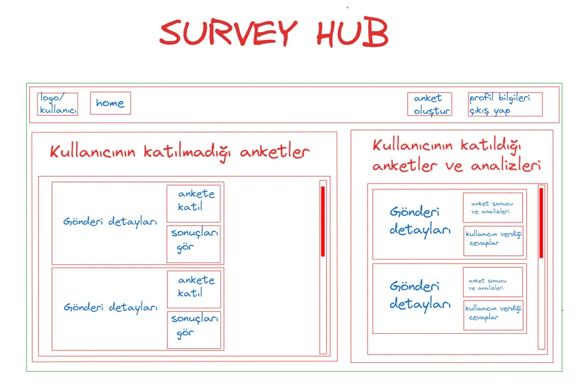

# Online Survey Hub Project

## İçindekiler
- [Proje Amacı](#proje-amacı)
- [Özellikler](#özellikler)
- [Proje Olası Görünümü](#proje-olası-görünümü)
- [İletişim](#iletişim)

## Proje Amacı

**Survey Hub**, SurveyHub, bireyler, işletmeler, araştırmacılar ve birçok alanda için anket oluşturma, 
yönetme ve analiz etme sürecini basitleştirmek üzere tasarlanmış yenilikçi bir platformdur.
Kullanıcı ister geri bildirimi topluyor, ister akademik araştırma yapıyor veya bir sosyal medya kampanyası başlatıyor olsun, 
SurveyHub kullanıcıların verimli ve etkili bir şekilde eyleme geçirilebilir bilgiler edinmesini sağlar.

## Özellikler
- Kullanıcılar için kayıt olma ve giriş yapma. (JWT Authentication ile)
- Kayıt olmayan kullanıcılar için anketleri görme. (Ankete katılamaz)
- Kayıt olan kullanıcıların anket oluşturup anketlere katılabilme.
- Farklı kategorilerde anket oluşturma, düzenleme, silme.
- Anket katılım tarihlerini takip etme.
- Güçlü bir RESTful API altyapısı.
- Spring Security ile yetkilendirme ve kimlik doğrulama.
- DTO Pattern kullanılarak temiz ve düzenli veri transferi.
- Anket sonuçlarının analizini inceleme.
- Anket sonuçlarını dinamik olarak takip edebilme.
- ...

## Proje Olası Görünümü
| Description   | Screenshot                                      |
|---------------|-------------------------------------------------|
| **Ana Sayfa** |  |

## İletişim
Herhangi bir sorunuz veya geri bildiriminiz varsa benimle iletişime geçebilirsiniz:

- Email: [zekiyetekin08@gmail.com](mailto:zekiyetekin08@gmail.com)
- LinkedIn: [Zekiye Tekin](https://www.linkedin.com/in/zekiyetekin)

